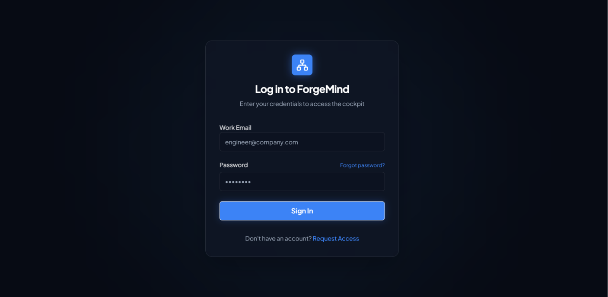
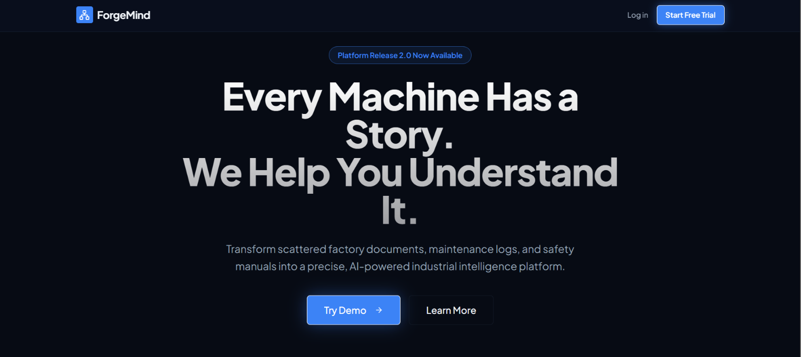
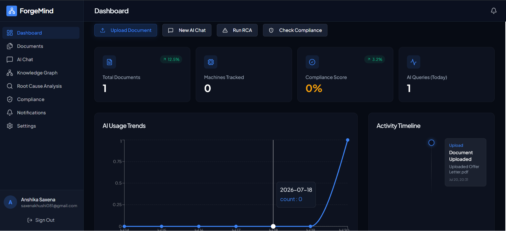
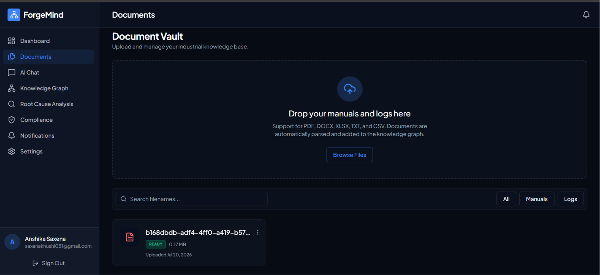
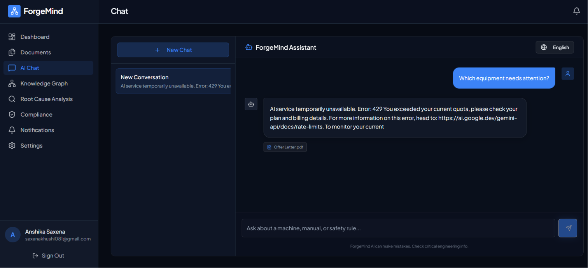
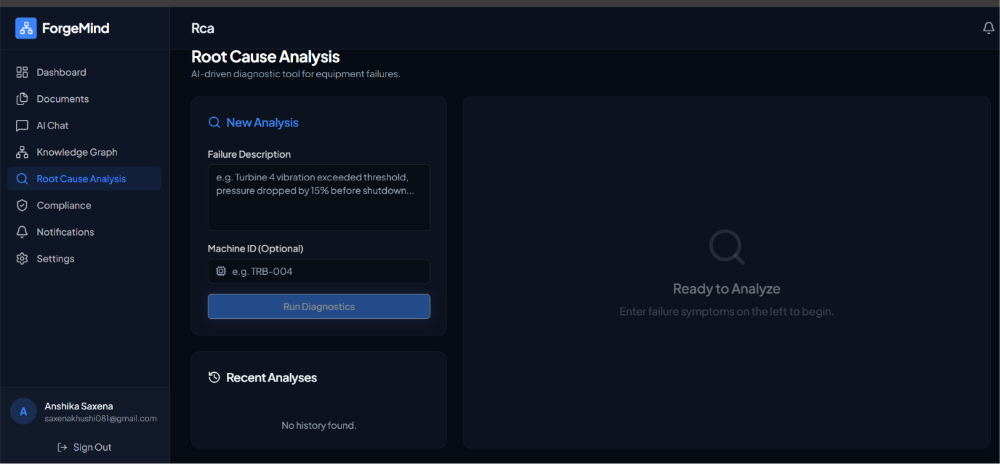
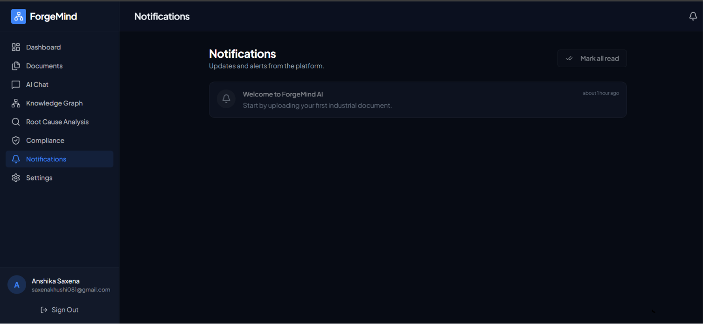
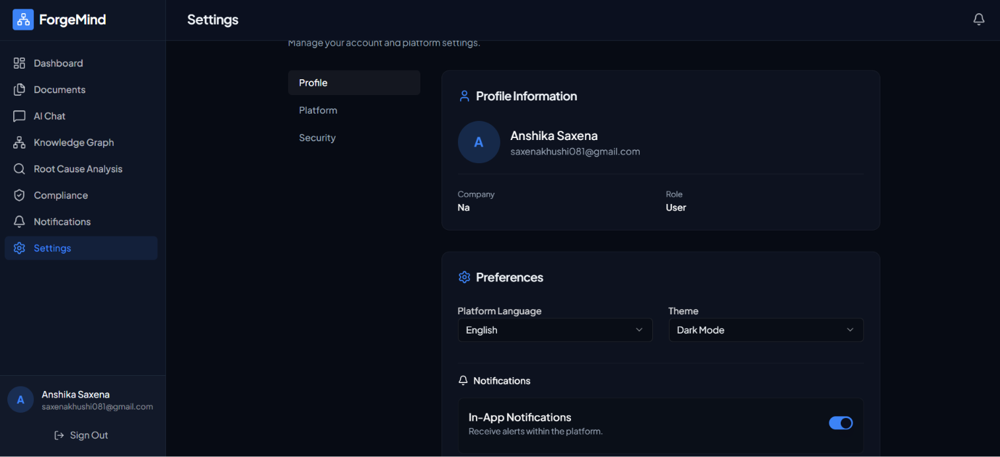
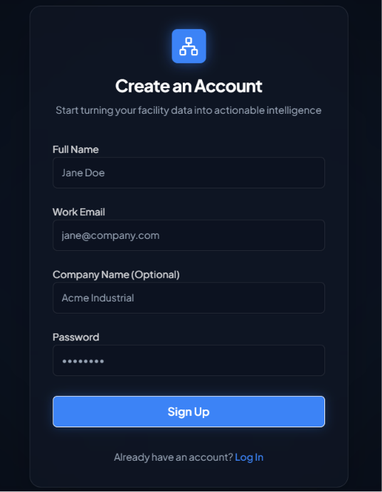

# ForgeMind AI 🏭🤖

**ForgeMind AI** is an AI-powered Industrial Knowledge Intelligence Platform that enables organizations to upload technical documents, extract knowledge, and interact with their industrial data using AI. The platform is designed to simplify document management, improve information retrieval, and assist engineers with intelligent insights from manuals, maintenance logs, and technical documentation.

---

## 🚀 Features

- 📄 Upload industrial documents (PDF, DOCX, XLSX, TXT, CSV)
- 🧠 AI-powered document processing and knowledge extraction
- 💬 Intelligent chat with uploaded documents
- 🔍 Semantic search across documents
- 📊 Interactive dashboard with analytics
- 🏭 Knowledge graph visualization
- 📋 Root Cause Analysis (RCA)
- ✅ Compliance checking
- 🔔 Notification system
- 🔐 Secure authentication with JWT
- 🌙 Modern responsive UI

---

## 🛠️ Tech Stack

### Frontend
- React
- TypeScript
- Vite
- Tailwind CSS
- React Query
- React Router
- ShadCN UI

### Backend
- FastAPI
- Python
- SQLAlchemy
- PostgreSQL
- JWT Authentication
- PyMuPDF
- LangChain
- FAISS
- Gemini AI API

---

## 📂 Project Structure

```
ForgeMindAI/
│
├── backend/
│   ├── api/
│   ├── ai/
│   ├── models/
│   ├── services/
│   └── database/
│
├── frontend/
│   ├── src/
│   ├── components/
│   ├── pages/
│   └── hooks/
│
├── uploads/
├── requirements.txt
└── README.md
```

---

## ⚙️ Installation

### 1. Clone the repository

```bash
git clone <repository-url>
cd ForgeMindAI
```

---

### 2. Backend Setup

Create a virtual environment

```bash
python -m venv venv
```

Activate it

#### Windows

```bash
venv\Scripts\activate
```

Install dependencies

```bash
pip install -r requirements.txt
```

Start backend

```bash
uvicorn backend.main:app --reload --port 8080
```

---

### 3. Frontend Setup

```bash
pnpm install
```

Run frontend

```bash
pnpm --filter @workspace/forge-mind dev
```

---

## 📸 Screenshots

> Add screenshots of:

### Login Page


### Front Page


### Dashboard


### Document Vault


### AI Chat


### Compliance Report


### Root Cause Analysis


### Notification


### Settings


### Sign Up Page


---

## 📌 Future Enhancements

- OCR Support for scanned PDFs
- Multi-language document understanding
- Voice-enabled AI assistant
- Predictive maintenance analytics
- Cloud deployment
- Role-based access control
- Real-time collaboration
- AI-generated maintenance recommendations

---

## 👥 Team Pixel Perfect

| Name | Branch |
|------|------|
| **Anshika Saxena** |3rd year | Computer Science and Design|
| **Arpita Raj** |3rd year | Computer Science and Design|
| **Krishna Chaudhary** | 3rd year | Computer Science and Engineering |

---

## 🙏 Acknowledgements

Special thanks to our mentors, faculty members, and everyone who supported us throughout the development of this project.

---

## 📜 License

This project is developed for educational and academic purposes.

---

### ⭐ If you found this project helpful, consider giving it a star!